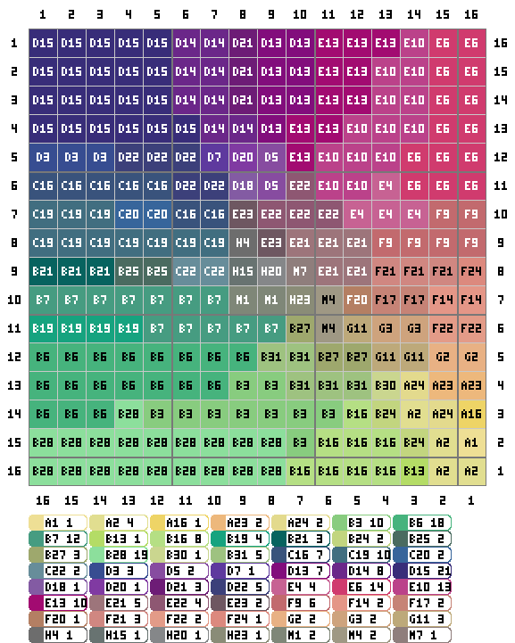

# Aseprite 拼豆图纸导出插件

[English](README_EN.md)

把 Aseprite 里打开的像素画一键导出为拼豆（fuse beads）图纸 PNG：每颗豆子标注 MARD/漫漫色号，四边带坐标序号，顶部信息条 + 底部用量统计。

## 安装

**方式一（推荐）**：从 [Releases](../../releases) 下载 `fuse-beads.aseprite-extension`，双击安装（或 编辑 > 首选项 > 扩展 > 添加扩展）。安装后在 **文件 > 导出 > 导出拼豆图纸** 使用。

**方式二**：把 `fuse-beads-export.lua` 和整个 `src/` 目录复制到 Aseprite 脚本目录（文件 > 脚本 > 打开脚本文件夹），然后 文件 > 脚本 > 重新扫描脚本文件夹，在 文件 > 脚本 里运行。

## 使用

1. 在 Aseprite 里打开像素画（建议先缩放到拼豆尺寸，如 64×64：精灵 > 精灵大小）
2. 运行 文件 > 导出 > 导出拼豆图纸（或脚本入口）
3. 对话框选项：
   - 输出文件：默认 `原名_pattern.png`
   - 色板：MARD/漫漫（默认）、Perler、Hama、Artkal
   - 豆子形状：方形（默认，填满格子）/ 圆形（直径可调）
   - 格子大小：默认 32px
   - 分格线间隔：默认 5 格一条加粗线，0/1 关闭
   - 四边序号：默认开（上/左 1→N，下/右 N→1，灰色底条）
   - 包含用量统计：默认开（含顶部信息条）
4. 点击导出

## 功能

- 当前帧合并图层导出，1 像素 = 1 颗豆
- 四套品牌色板：MARD/漫漫 221 实色（A–H + M 系列，取自官方色卡）、Perler 103、Hama 92、Artkal C 174（后三套数据来自 [beadcolors](https://github.com/maxcleme/beadcolors)，MIT）
- CIEDE2000 颜色匹配
- 透明像素自动留空
- 单边超过 128 像素时弹出卡死风险警告

## 色板数据

`src/palette_mard.lua` 每行一个色号：`{ code = "A1", name = "A1", rgb = { r = R, g = G, b = B } }`，可直接编辑增删。注意：色值取自官方色卡照片，与实物可能有轻微色差。

## 开发

测试：`powershell -ExecutionPolicy Bypass -File run-tests.ps1`（无头调用 Aseprite 运行全部断言）。

打包扩展：改 `package.json` 版本号后运行 `powershell -ExecutionPolicy Bypass -File build-extension.ps1`。

## 致谢

- Perler / Hama / Artkal 色板数据来自 [maxcleme/beadcolors](https://github.com/maxcleme/beadcolors)（MIT License），感谢作者及数据贡献者。
- MARD/漫漫色板 RGB 提取自官方色卡（见 `refs/colorcard-mard.jpg`）。

## License

MIT
